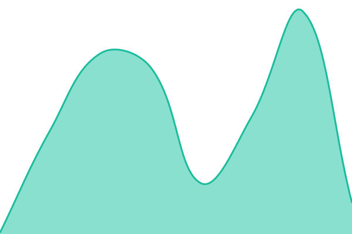

# NextPDF Status

Uptime monitoring and incident history for NextPDF public services, powered by [Upptime](https://github.com/upptime/upptime).

Status website: [status.getnextpdf.com](https://status.getnextpdf.com)

<!--start: status pages-->
<!-- This summary is generated by Upptime (https://github.com/upptime/upptime) -->
<!-- Do not edit this manually, your changes will be overwritten -->
<!-- prettier-ignore -->
| URL | Status | History | Response Time | Uptime |
| --- | ------ | ------- | ------------- | ------ |
|  [Marketing Site](https://getnextpdf.com) | 🟩 Up | [marketing-site.yml](https://github.com/nextpdf-labs/status/commits/HEAD/history/marketing-site.yml) | 

 151ms
     
 | 

<a href="https://status.getnextpdf.com/history/marketing-site">100.00%</a>
    

|  [Documentation](https://nextpdf.dev/docs/) | 🟩 Up | [documentation.yml](https://github.com/nextpdf-labs/status/commits/HEAD/history/documentation.yml) | 

 137ms
     
 | 

<a href="https://status.getnextpdf.com/history/documentation">100.00%</a>
    

|  [License Activation Service](https://app.getnextpdf.com/api/license/jwks) | 🟩 Up | [license-activation-service.yml](https://github.com/nextpdf-labs/status/commits/HEAD/history/license-activation-service.yml) | 

 892ms
     
 | 

<a href="https://status.getnextpdf.com/history/license-activation-service">100.00%</a>
    

|  [Customer Portal](https://app.getnextpdf.com) | 🟩 Up | [customer-portal.yml](https://github.com/nextpdf-labs/status/commits/HEAD/history/customer-portal.yml) | 

 111ms
     
 | 

<a href="https://status.getnextpdf.com/history/customer-portal">100.00%</a>
    

<!--end: status pages-->

This repository contains the open-source uptime monitor and status page for [NextPDF Labs](https://status.getnextpdf.com), powered by [Upptime](https://github.com/upptime/upptime).

[**Visit our status website →**](https://status.getnextpdf.com)
